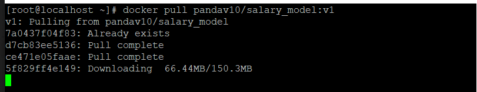
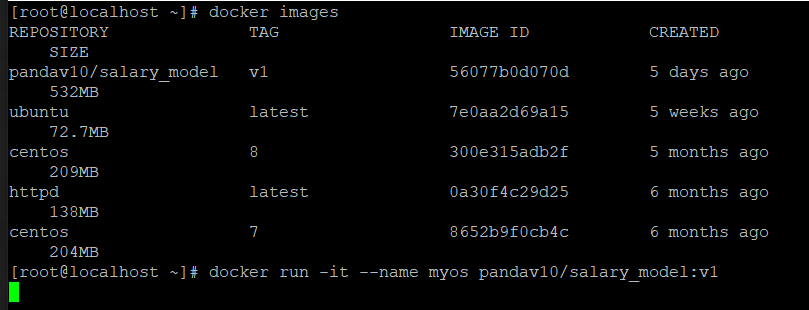
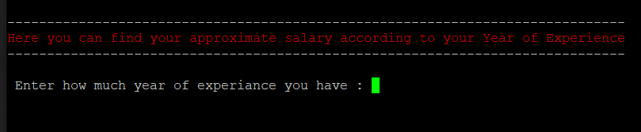
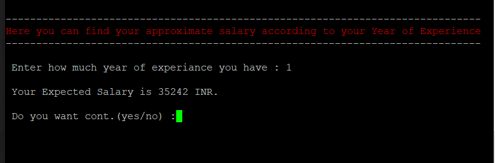

# Predicting_salary_on_docker
Using this Docker image an employees can predict their approximate salary on the basis of Year of Experiance in their job profile.
## How to use the docker image
1.First download the image from docker hub:
  `docker pull pandav10/salary_model:v1`

2.Run the docker image
  `docker run -it  pandav10/salary_model:v1`

#### Now you can enter your year of experiance and find the expected salary.

Note: This model is created using small dataset so it is not useful for real world use case.
